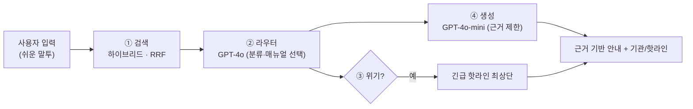

# 아이로(路)

> 아이들을 위한 길, 아이들을 위한 LAW

**아동·청소년을 위한 쉬운 법률 가이드 서비스**

카카오 테크포임팩트 캠퍼스 | 한양대학교 아이온팀

[서비스 바로가기](https://i-law-web.vercel.app)

---

## ✍️ 프로젝트 개요

| | |
|:---|:---|
| **프로젝트명** | 아이로(路) |
| **프로젝트 기간** | 2026.03 ~ 2026.08 |
| **프로젝트 형태** | 카카오와 함께하는 테크포임팩트 캠퍼스 |
| **소속** | 한양대학교 아이온팀 |
| **주요 타겟** | 법적 문제에 대한 이해·판단·해결이 필요한 모든 아동·청소년 |

---

## ✍️ 프로젝트 소개

### 배경

아동·청소년은 여전히 법률의 사각지대에 놓여 있습니다.

| 분야 | 현황 |
|:---:|:---|
| #노동 | 임금체불을 당한 10대 청소년 2021년 2,945명 → 2023년 3,356명으로 증가 |
| #학교폭력 | 학교 폭력 피해 응답률 5개년 꾸준히 증가 (2021년 1.1% → 2025년 2.5%) |
| #아동학대 | 2024년 아동학대 신고 접수 50,242건으로 전년 대비 1,720건 증가 |
| #성폭력 | 2023년 아동·청소년 대상 피해 아동·청소년 수 24.8% 증가 |

### 문제 정의

1. **기존 대안의 한계**
   - 법률 매뉴얼이 있어도 아동·청소년이 직접 바로 활용하기 어려움
   - 도움을 어디에 요청해야 할지 모르는 경우가 많음

2. **법적 권리 인식 부족**
   - 청소년 50명 대상 설문조사에서 법적 문제 대처 방법 인지도 평균 2.7점 (5점 만점)
   - 학교 폭력 피해를 알리지 않은 학생 약 25만 명 — "별일 아니라고 생각해서", "일이 커질 것 같아서"

### 솔루션

법률적 사각지대에 놓인 아동·청소년이 문제상황별 필요한 정보를 빠르게 찾고, 적절한 기관으로 연결되며, 자신의 권리 문제를 쉬운 콘텐츠로 이해할 수 있도록 돕는 **아동·청소년 맞춤 법률 가이드 앱**입니다.

| | |
|:---:|:---|
| **#쉽고 빠른** | 아동·청소년의 상황에 맞는 편리한 눈높이 매뉴얼 |
| **#믿을 수 있는** | 아동·청소년 전문 변호사가 직접 답해주는 QnA |
| **#함께 나누는** | 경험과 정보를 나누며 서로 성장하는 커뮤니티 |

---

## 🚀 프로젝트 목표

1. **법적 권리 인식 향상** — 쉬운 눈높이의 법률 정보로 아동·청소년의 법적 감수성·접근성 향상
2. **신속한 초기 대응 지원** — AI 챗봇을 통해 상황을 빠르게 진단하고 초기 행동 방향 안내
3. **적절한 기관 연결** — 상황에 맞는 최적의 상담·지원 기관으로 직접 연결
4. **신뢰할 수 있는 전문가 답변** — 전문 변호사가 직접 답변하는 QnA로 검증된 법률 정보 제공

---

## 📌 주요 기능

### 1. 법률 매뉴얼

카테고리별로 정리된 아동·청소년 맞춤 법률 정보를 제공합니다.

- **카테고리:** 아동학대/가정폭력, 노동, 금융, 성폭력, 온라인폭력, 출생/양육, 법정대리인, 학교폭력, 학교 밖 청소년
- 카테고리 선택 시 질문 형식의 매뉴얼 리스트 제공
- 질문 선택 시 쉽고 상세한 법률 정보 안내
- 카테고리별 '도움이 필요하신가요?' 버튼으로 지역별 상담 기관 연결 및 상담 전 준비 가이드 제공

### 2. QnA — 변호사 직접 답변

- 아동·청소년 전문 변호사가 직접 질문에 답변
- 질문 제목, 카테고리, 사진 첨부 가능
- 답변 완료/대기 상태 표시

### 3. 커뮤니티

- 경험과 정보를 나누는 익명 커뮤니티
- 게시글 작성 시 본문, 사진, 투표 추가 가능
- 댓글, 좋아요 기능

### 4. AI 상황 진단 챗봇

사용자가 자신의 상황을 **평소 말투로** 입력하면, 맞는 법률 매뉴얼을 **근거로** 안내하고 위기 상황이면 긴급 핫라인을 먼저 띄웁니다.
"매뉴얼 전체를 프롬프트에 통째로 넣기"가 아니라, **검색 → 라우팅 → 근거 생성**의 2단계 RAG로 동작하며, **선택된 매뉴얼 본문에 근거**해 답합니다(근거 밖 내용은 만들지 않음 — 환각 차단).

- **① 검색 (Retrieval)** — 전 카테고리에서 관련 매뉴얼 후보를 압축
  - **렉시컬**: 트라이그램 + 동의어 확장 (후보 풀 150개)
  - **시맨틱**: pgvector 코사인 유사도, `text-embedding-3-large`(1536차원)
  - 두 랭킹을 **RRF(Reciprocal Rank Fusion, k=60)**로 융합 → **상위 8개 후보** (임베딩 실패 시 렉시컬 단독으로 자동 강등)
- **② 라우터 (Router)** — `GPT-4o` — 상황을 `relevant / unrelated / needs_clarification`로 분류하고, 후보 중 **진짜 맞는 매뉴얼만** 선택. 후보 밖 ID는 차단(환각 가드).
- **③ 위기 감지** — 규칙(키워드) **또는** 라우터 신호 중 하나만 걸려도 위기 처리 → 핫라인 최상단 노출
- **④ 생성 (Generation)** — `GPT-4o-mini` — 선택된 매뉴얼 **전문만** 근거로 안내 생성. 근거 없으면 안전 폴백 + 변호사 상담 권유

> 운영 안전장치: 일일 10회·분당 3회 요청 제한, 15초 타임아웃, 답변 토큰 상한.
> 품질은 자체 평가 하네스(**iLaw-Bench**)로 검색·분류·위기·근거충실도·지연 등 6지표를 자동 측정합니다.

### 5. 홈화면

- 최근 스크랩·좋아요·댓글 기반 추천 콘텐츠 목록
- 키워드 검색 시 매뉴얼, QnA, 커뮤니티 통합 검색 결과 제공

### 6. 마이페이지

- 내 스크랩 콘텐츠 확인, 내가 작성한 질문 확인
- 알림 설정 (질문 답변, 매뉴얼 업데이트, 커뮤니티 좋아요/댓글)
- 튜토리얼
- 소셜 로그인 (Google, Kakao)

---

## 🧑‍💻 팀원 소개

| **이름** | **역할** |
|:--------:|:--------:|
| 조윤지 | PM |
| 김소연 | FE |
| 이소령 | UI/UX |
| 탁나연 | BE |

---

## ⚙️ 기술 스택

<table>
  <thead>
    <tr>
      <th>분류</th>
      <th>기술 스택</th>
    </tr>
  </thead>
  <tbody>
    <tr>
      <td>프론트엔드</td>
      <td>
        
        
        
        
      </td>
    </tr>
    <tr>
      <td>백엔드</td>
      <td>
        
        
        
        
      </td>
    </tr>
    <tr>
      <td>데이터베이스</td>
      <td>
        
        
      </td>
    </tr>
    <tr>
      <td>AI</td>
      <td>
        
        
        
        
      </td>
    </tr>
    <tr>
      <td>인프라</td>
      <td>
        
        
        
      </td>
    </tr>
    <tr>
      <td>인증</td>
      <td>
        
        
        
      </td>
    </tr>
  </tbody>
</table>

---

## 📂 문서 자료

- [발표 자료](https://canva.link/wuoe13qqk0cib37)
